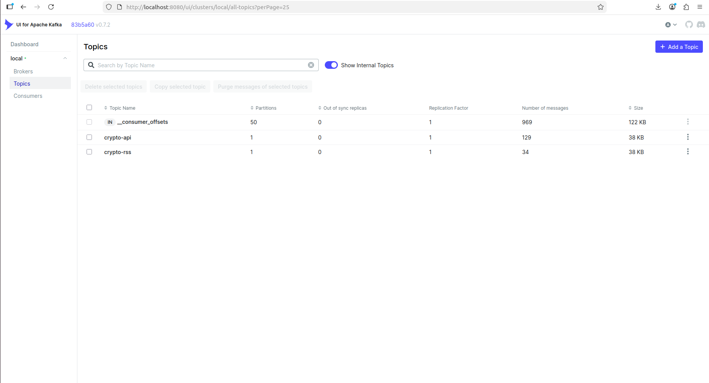
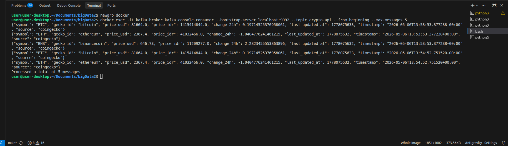
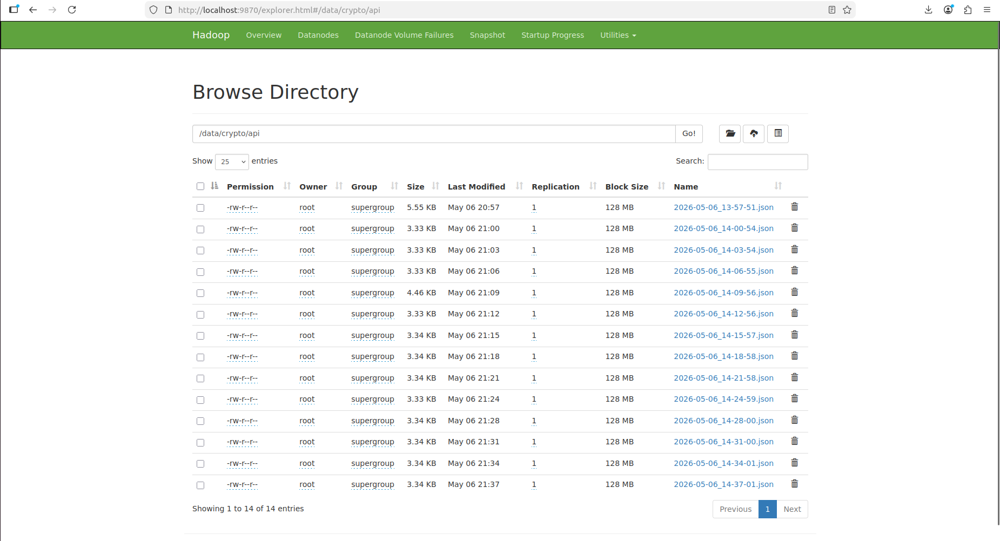
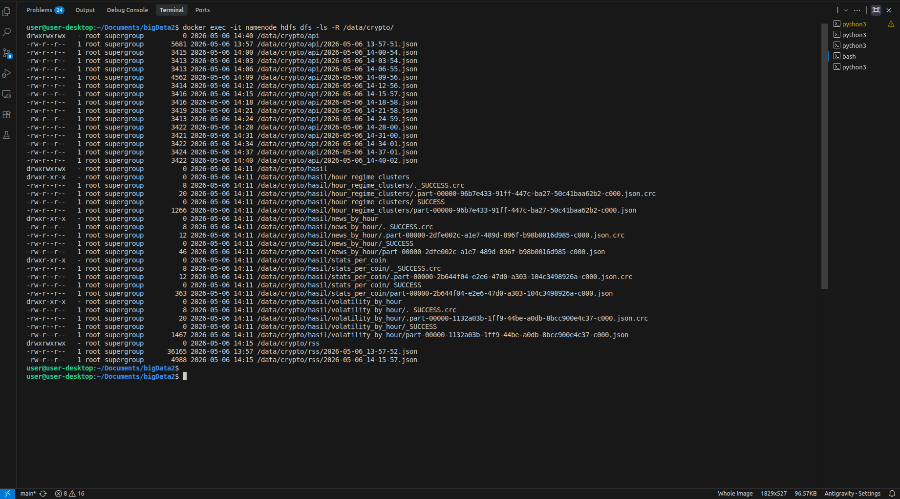
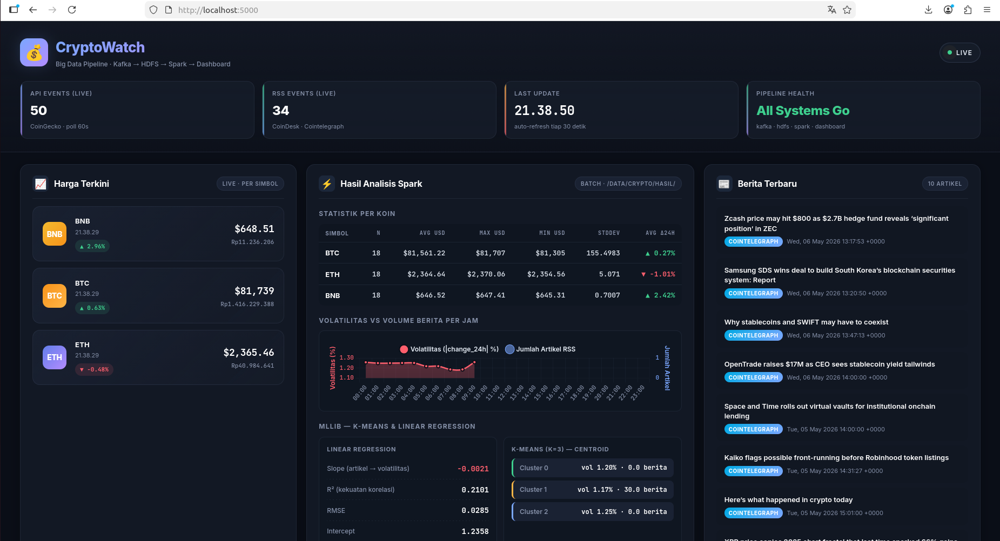
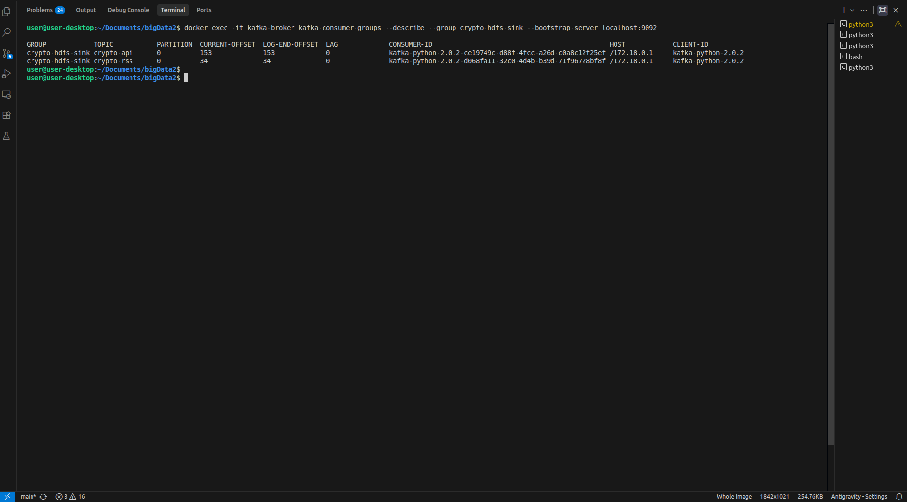

# 💰 CryptoWatch — Monitor Pasar Aset Digital

ETS Praktik Kelompok · Mata Kuliah **Big Data dan Data Lakehouse** · Institut Teknologi Sepuluh Nopember

Sistem end-to-end pipeline Big Data yang menjawab pertanyaan bisnis:
> *"Pada jam berapa harga kripto paling volatile? Dan apakah berita yang muncul sejalan dengan pergerakan harga?"*

---

## 👥 Anggota Kelompok & Kontribusi

| NRP | Nama | Kontribusi Utama |
|-----|------|------------------|
| 5027241001 | **Ahmad Wildan Fawwaz** | Setup Docker Compose (Kafka + Hadoop), inisialisasi Kafka topic + HDFS directory, troubleshooting infrastruktur |
| 5027241040 | **Ahmad Yazid Arifuddin** | `kafka/producer_api.py` (CoinGecko) + `kafka/producer_rss.py` (RSS feed + dedup) |
| 5027241108 | **Erlinda Annisa Zahra** | `kafka/consumer_to_hdfs.py` (threading + library `hdfs`) + `dashboard/` (Flask + Chart.js) |
| 5027241123 | **M Faqih Ridho** | `spark/analysis.ipynb` + `spark/analysis.py` — 3 analisis wajib + Bonus MLlib (K-Means + Linear Regression) |

> Tiap file utama diberi komentar `# [NamaAnggota]: ...` sesuai pembagian di atas.

---

## 🎯 Topik yang Dipilih — Topik 1: CryptoWatch

**Justifikasi singkat:** pasar kripto 24/7 dan sangat volatile, cocok untuk pipeline real-time. CoinGecko menyediakan API gratis tanpa API key dengan rate limit longgar, dan CoinDesk / Cointelegraph memberikan RSS berita kripto yang stabil. Kombinasi harga + berita relevan untuk pertanyaan bisnis.

---

## 🏗️ Arsitektur Sistem

```
 ┌───────────────────┐        ┌──────────────────┐
 │ CoinGecko API     │        │ CoinDesk / CT RSS│
 │ (harga BTC/ETH/BNB│        │ (berita kripto)  │
 └────────┬──────────┘        └────────┬─────────┘
          │ poll 60s                   │ poll 5m + dedup
          ▼                            ▼
 ┌──────────────────┐        ┌───────────────────┐
 │ producer_api.py  │        │ producer_rss.py   │
 └────────┬─────────┘        └────────┬──────────┘
          │ JSON + key=symbol         │ JSON + key=hash(url)
          ▼                            ▼
     ╔═══════════════════════════════════════════╗
     ║        APACHE KAFKA  (localhost:9092)      ║
     ║  topic: crypto-api     topic: crypto-rss   ║
     ╚═════════════════════╤══════════════════════╝
                           │  consumer_to_hdfs.py
                           ▼   (threading, lib `hdfs`)
     ╔═══════════════════════════════════════════╗
     ║     HADOOP HDFS  (namenode:9000)           ║
     ║  /data/crypto/api/    /data/crypto/rss/    ║
     ║  /data/crypto/hasil/  (diisi Spark)        ║
     ╚═════════════════════╤══════════════════════╝
                           ▼
                  ┌────────────────┐
                  │  Apache Spark  │  3 analisis + MLlib
                  │  analysis.py   │
                  └────────┬───────┘
                           │ hasil ke HDFS + spark_results.json
                           ▼
                 ┌─────────────────┐
                 │ Flask Dashboard │  localhost:5000
                 │  + Chart.js     │  auto-refresh 30s
                 └─────────────────┘
```

Diagram versi gambar: `docs/arsitektur.png` *(lampirkan setelah di-render)*.

---

## 📁 Struktur Repository

```
ETS/
├── README.md                      ← dokumen ini
├── ets-big-data-system.md         ← briefing dosen
├── .gitignore
├── requirements.txt
├── docker-compose-kafka.yml       ← Kafka + Zookeeper + Kafka UI
├── docker-compose-hadoop.yml      ← Namenode + Datanode + YARN
├── hadoop.env                     ← env var untuk Hadoop
│
├── kafka/
│   ├── producer_api.py            ← CoinGecko poller
│   ├── producer_rss.py            ← RSS poller + dedup
│   └── consumer_to_hdfs.py        ← Kafka → HDFS (lib hdfs Python)
│
├── spark/
│   ├── analysis.ipynb             ← notebook demo (3 analisis + MLlib)
│   └── analysis.py                ← runnable script ekuivalen
│
├── dashboard/
│   ├── app.py                     ← Flask server (port 5000)
│   ├── templates/index.html
│   ├── static/style.css
│   ├── static/app.js              ← fetch /api/data + Chart.js
│   └── data/                      ← .gitignored (live buffer + spark_results)
│
└── docs/
    └── screenshots/               ← (bukti demo)
```

---

## 🚀 Cara Menjalankan (Step-by-Step) — Panduan Lengkap Windows

> Panduan ini ditulis ulang berdasarkan pengalaman nyata menjalankan pipeline ini di Windows 11. Ikuti step dari atas sampai bawah; **jangan di-skip** — banyak error yang kita temukan datang dari prasyarat yang belum lengkap.

### 📦 Prasyarat — Tools yang Wajib Di-install

Sebelum menjalankan apa pun, install dulu semua ini:

#### 1. Docker Desktop
- Download: https://www.docker.com/products/docker-desktop/
- **Setelah install, BUKA aplikasi Docker Desktop** dan tunggu sampai icon di taskbar kanan bawah berubah hijau (status "Docker Desktop is running").
- Pada Windows, Docker butuh WSL2. Bila diminta enable WSL2, ikuti wizard-nya (reboot sekali).
- Verifikasi di PowerShell:
  ```powershell
  docker --version
  docker ps
  ```
  Kalau `docker ps` error "cannot connect to Docker daemon", berarti Docker Desktop belum jalan — buka aplikasinya dulu.

#### 2. Python 3.11 atau 3.12
- Download: https://www.python.org/downloads/
- **JANGAN pakai Python 3.14** — beberapa library (pandas, PySpark) belum support sepenuhnya.
- Saat install, **centang "Add Python to PATH"**.
- Verifikasi:
  ```powershell
  python --version
  # harus cetak Python 3.11.x atau 3.12.x
  ```

#### 3. Java 17 (Eclipse Adoptium / Temurin)
- Download: https://adoptium.net/temurin/releases/?version=17
- Pilih **OpenJDK 17 LTS → Windows x64 → .msi Installer** (bukan .zip, supaya otomatis set PATH).
- Setelah install, **verifikasi lokasi** — biasanya di:
  ```
  C:\Program Files\Eclipse Adoptium\jdk-17.0.x.x-hotspot
  ```
- Set `JAVA_HOME` environment variable (PENTING, PySpark butuh ini):
  ```powershell
  # Cara 1: permanent via PowerShell (buka PowerShell sebagai Administrator)
  setx JAVA_HOME "C:\Program Files\Eclipse Adoptium\jdk-17.0.18.8-hotspot" /M
  # Ganti angka versi sesuai folder yang terinstall di komputer kamu!

  # Cara 2: manual via GUI
  # Win+R → sysdm.cpl → tab Advanced → Environment Variables → New (System variables)
  # Variable name: JAVA_HOME
  # Variable value: C:\Program Files\Eclipse Adoptium\jdk-17.0.18.8-hotspot
  ```
- **Tutup semua PowerShell/terminal dan buka yang baru**, lalu verifikasi:
  ```powershell
  echo $env:JAVA_HOME
  java -version
  # harus cetak: openjdk version "17.0.x"
  ```

#### 4. Hadoop Winutils (wajib untuk Spark di Windows)

Spark di Windows butuh `winutils.exe` + `hadoop.dll`. Tanpa ini, Spark crash dengan error `UnsatisfiedLinkError: NativeIO$Windows.access0`.

Buka **PowerShell** lalu jalankan:
```powershell
mkdir C:\hadoop\bin -Force
Invoke-WebRequest -Uri "https://github.com/cdarlint/winutils/raw/master/hadoop-3.3.6/bin/winutils.exe" -OutFile "C:\hadoop\bin\winutils.exe"
Invoke-WebRequest -Uri "https://github.com/cdarlint/winutils/raw/master/hadoop-3.3.6/bin/hadoop.dll" -OutFile "C:\hadoop\bin\hadoop.dll"
setx HADOOP_HOME "C:\hadoop" /M
```

Verifikasi (harus keduanya cetak `True`):
```powershell
Test-Path C:\hadoop\bin\winutils.exe
Test-Path C:\hadoop\bin\hadoop.dll
```

**Tutup semua PowerShell dan buka yang baru** agar env var terbaca.

#### 5. Git (optional tapi recommended)
- Download: https://git-scm.com/download/win
- Digunakan untuk clone repo dan menjalankan Git Bash.

#### 6. VS Code (recommended)
- Download: https://code.visualstudio.com/
- Install extension **Python** (Microsoft).
- **Matikan auto-aktivasi venv** agar kita bisa kontrol manual (hindari error shadowing env var):
  - `Ctrl+Shift+P` → "Preferences: Open User Settings (JSON)"
  - Tambahkan:
    ```json
    "python.terminal.activateEnvironment": false
    ```

---

### 0) Clone Repository & Setup Python venv

Buka **PowerShell** di folder tempat kamu mau clone:

```powershell
git clone https://github.com/[kelompok-X]/ets-cryptowatch.git
cd ets-cryptowatch

# Buat virtual environment
python -m venv .venv

# Aktivasi venv (PowerShell)
.venv\Scripts\Activate.ps1

# Kalau error "running scripts is disabled on this system":
# Set-ExecutionPolicy -Scope CurrentUser -ExecutionPolicy RemoteSigned
# jawab Y, lalu ulangi Activate.ps1

# Kalau pakai Git Bash:
# source .venv/Scripts/activate

# Install semua dependency
pip install --upgrade pip
pip install -r requirements.txt
```

Verifikasi:
```powershell
pip list | Select-String "pyspark|kafka|flask|hdfs"
# harus muncul: pyspark, kafka-python, flask, hdfs
```

> **Tips**: kalau `pip install` lambat atau gagal, coba `pip install -r requirements.txt --no-cache-dir`.

### 1) Start Kafka Stack

> **PENTING**: Pastikan Docker Desktop sudah running (icon hijau di taskbar).

```powershell
docker compose -f docker-compose-kafka.yml up -d
```

Tunggu ~30 detik sampai broker siap. Verifikasi:

```powershell
# Cek container jalan (harus ada kafka-broker, zookeeper, kafka-ui)
docker ps

# List topic (awalnya kosong)
docker exec -it kafka-broker kafka-topics --list --bootstrap-server localhost:9092

# Buat kedua topic
docker exec -it kafka-broker kafka-topics --create --topic crypto-api --bootstrap-server localhost:9092 --partitions 1 --replication-factor 1
docker exec -it kafka-broker kafka-topics --create --topic crypto-rss --bootstrap-server localhost:9092 --partitions 1 --replication-factor 1
```

Kafka UI tersedia di **http://localhost:8080** (berguna untuk monitor dan screenshot demo).

### 2) Start Hadoop Stack

```powershell
docker compose -f docker-compose-hadoop.yml up -d
```

Tunggu ~60 detik. Verifikasi:

```powershell
docker ps
# Harus ada 5 container: namenode, datanode, resourcemanager, nodemanager, historyserver

# Atau buka Namenode Web UI:
# http://localhost:9870   (tab Overview + Utilities → Browse directory)
```

Buat struktur direktori di HDFS:

```powershell
docker exec -it namenode hdfs dfs -mkdir -p /data/crypto/api /data/crypto/rss /data/crypto/hasil
docker exec -it namenode hdfs dfs -chmod -R 777 /data/crypto
docker exec -it namenode hdfs dfs -ls -R /data/crypto
```

> **Catatan Windows**: `docker-compose-hadoop.yml` sudah expose port datanode (9864, 9866, 9867) dan `hadoop.env` sudah set `dfs_datanode_hostname=localhost` agar WebHDFS bisa diakses dari Windows host. Kalau kamu modif file ini, pastikan konfigurasi tersebut tetap ada.

### 3) Start Producers (2 terminal terpisah)

> Setiap terminal baru **harus aktivasi venv dulu**: `.venv\Scripts\Activate.ps1`

**Terminal A — API producer** (CoinGecko, poll 60 detik):
```powershell
.venv\Scripts\Activate.ps1
python kafka/producer_api.py
```
Log yang diharapkan:
```
[producer_api] INFO - Kirim BTC USD=67432.12 chg=2.15% -> crypto-api[p=0 o=0]
[producer_api] INFO - Kirim ETH USD=3245.67 chg=1.02% -> crypto-api[p=0 o=1]
...
```

**Terminal B — RSS producer** (CoinDesk/Cointelegraph, poll 5 menit):
```powershell
.venv\Scripts\Activate.ps1
python kafka/producer_rss.py
```

Biarkan kedua terminal **tetap jalan** — jangan tutup.

### 4) Start Consumer → HDFS (terminal ke-3)

```powershell
.venv\Scripts\Activate.ps1
python kafka/consumer_to_hdfs.py
```

Consumer akan:
- Membaca kedua topic secara paralel (threading)
- Buffer event dalam memory, **flush ke HDFS tiap 3 menit**
- Meng-update salinan live `dashboard/data/live_api.json` dan `live_rss.json` setiap event masuk (dashboard butuh ini)

> **PENTING — tunggu minimal 5-10 menit** sebelum lanjut ke step berikutnya, supaya ada beberapa kali flush HDFS dan data cukup untuk analisis.

Verifikasi file JSON muncul di HDFS (terminal ke-4):

```powershell
docker exec -it namenode hdfs dfs -ls -R /data/crypto/
docker exec -it namenode hdfs dfs -du -h /data/crypto/api/
```

Kamu harus melihat file dengan format `batch-<timestamp>.json` di `/data/crypto/api/` dan `/data/crypto/rss/`. Kalau masih kosong, **tunggu lebih lama** (consumer flush tiap 3 menit).

### 5) Jalankan Spark Analysis

Setelah minimal 5-10 menit data terkumpul (confirmed ada file di HDFS), buka **terminal ke-5**:

```powershell
.venv\Scripts\Activate.ps1

# Verifikasi env var sebelum menjalankan Spark
echo $env:JAVA_HOME       # harus menunjuk ke folder JDK 17
echo $env:HADOOP_HOME     # harus C:\hadoop
Test-Path $env:HADOOP_HOME\bin\winutils.exe   # harus True

# Jalankan analysis
python spark/analysis.py
```

**Yang dilakukan script:**
1. Download semua file JSON dari HDFS ke folder staging lokal (via WebHDFS library Python)
2. Spark baca dari staging lokal → jalankan 3 analisis + MLlib
3. Upload hasil ke HDFS `/data/crypto/hasil/` (via WebHDFS)
4. Simpan ringkasan ke `dashboard/data/spark_results.json`

**Output yang diharapkan:**
- 4 sub-folder di HDFS: `stats_per_coin`, `volatility_by_hour`, `news_by_hour`, `hour_regime_clusters`
- File `dashboard/data/spark_results.json` terbuat/ter-update

Untuk demo interaktif, kamu juga bisa buka notebook:
```powershell
pip install jupyter
jupyter notebook spark/analysis.ipynb
```

### 6) Start Dashboard (terminal ke-6)

```powershell
.venv\Scripts\Activate.ps1
python dashboard/app.py
```

Buka **http://localhost:5000**. Dashboard akan:
- Menampilkan harga live terbaru (dari `live_api.json`)
- Menampilkan hasil Spark (tabel statistik + chart Chart.js)
- Menampilkan hasil MLlib (cluster centers + slope regresi)
- Menampilkan 10 berita terbaru
- **Auto-refresh setiap 30 detik**

---

## 🧰 Ringkasan Terminal yang Harus Tetap Running

Saat demo, kamu idealnya punya **6 terminal** yang aktif bersamaan:

| # | Terminal | Perintah | Catatan |
|---|----------|----------|---------|
| 1 | Producer API | `python kafka/producer_api.py` | Biarkan jalan |
| 2 | Producer RSS | `python kafka/producer_rss.py` | Biarkan jalan |
| 3 | Consumer | `python kafka/consumer_to_hdfs.py` | Biarkan jalan |
| 4 | Dashboard | `python dashboard/app.py` | Biarkan jalan |
| 5 | Spark (sesekali) | `python spark/analysis.py` | Run setelah data terkumpul |
| 6 | Bebas (verifikasi) | `docker exec ...` | Untuk cek HDFS |

Docker Desktop juga harus tetap running di background (kafka + hadoop stack).

---

## 🧯 Troubleshooting Berdasarkan Pengalaman Real

### ❌ `source : The term 'source' is not recognized`
- Kamu pakai PowerShell tapi ketik syntax Bash. Ganti dengan: `.venv\Scripts\Activate.ps1`

### ❌ `running scripts is disabled on this system` saat Activate.ps1
```powershell
Set-ExecutionPolicy -Scope CurrentUser -ExecutionPolicy RemoteSigned
# jawab Y, lalu ulangi Activate.ps1
```

### ❌ `docker : cannot connect to Docker daemon`
- Docker Desktop belum dijalankan. Buka aplikasi Docker Desktop, tunggu icon jadi hijau.

### ❌ `ModuleNotFoundError: No module named 'requests'` (atau flask/kafka)
- venv belum aktif. Jalankan `.venv\Scripts\Activate.ps1` dulu sebelum `python ...`

### ❌ `Java not found and JAVA_HOME environment variable is not set`
- JAVA_HOME belum di-set atau belum di-pick-up. Quick fix untuk terminal sekarang:
  ```powershell
  $env:JAVA_HOME = "C:\Program Files\Eclipse Adoptium\jdk-17.0.18.8-hotspot"
  $env:Path = "$env:JAVA_HOME\bin;$env:Path"
  ```
- Permanent fix: lihat Prasyarat #3 di atas (jalankan `setx JAVA_HOME ... /M` lalu **tutup semua PowerShell** dan buka baru).

### ❌ `UnsatisfiedLinkError: NativeIO$Windows.access0` saat Spark
- `winutils.exe` / `hadoop.dll` belum ada. Lihat Prasyarat #4 di atas.

### ❌ `NameResolutionError: Failed to resolve 'datanode'` saat consumer
- Port datanode belum di-expose di `docker-compose-hadoop.yml`, atau `dfs_datanode_hostname` belum `localhost` di `hadoop.env`. Pastikan kedua file ada setting yang dijelaskan di bagian sistem compose.
- Restart container setelah mengubah env file:
  ```powershell
  docker compose -f docker-compose-hadoop.yml down
  docker compose -f docker-compose-hadoop.yml up -d
  ```

### ❌ `BlockMissingException` saat Spark baca HDFS
- Spark native HDFS client tidak bisa hit datanode Docker dari Windows. `spark/analysis.py` sudah di-refactor untuk mirror dari HDFS via WebHDFS ke folder lokal dulu — script akan handle ini otomatis. Kalau kamu pakai notebook custom, import fungsi yang sama.

### ❌ `UNABLE_TO_INFER_SCHEMA: Unable to infer schema for JSON`
- HDFS masih kosong. Consumer belum flush (flush tiap 3 menit). Tunggu lebih lama atau cek `docker exec -it namenode hdfs dfs -ls /data/crypto/api/` dulu — harus ada file sebelum run Spark.

### ❌ Dashboard panel Spark kosong
- `dashboard/data/spark_results.json` belum ada → Spark belum pernah berhasil run. Scroll ke atas cek error di terminal Spark.

### ❌ VS Code auto-aktivasi venv tiap buka terminal (mengganggu)
- Tambahkan di User settings JSON: `"python.terminal.activateEnvironment": false`

---

## 🛑 Cara Menghentikan Semua Service

```powershell
# Ctrl+C di semua terminal Python (producer, consumer, dashboard)

# Stop Docker containers
docker compose -f docker-compose-kafka.yml down
docker compose -f docker-compose-hadoop.yml down

# Kalau ingin hapus data juga (volumes):
docker compose -f docker-compose-hadoop.yml down -v
```

---

## 📸 Screenshot (bukti demo)

> Lampirkan screenshot berikut di folder `docs/screenshots/` dan referensikan di sini.

1. **Kafka UI** menampilkan 2 topic aktif (`crypto-api`, `crypto-rss`) dengan message count > 0
   
2. **kafka-console-consumer output** menampilkan event JSON dari kedua topic
   
3. **HDFS Web UI** (http://localhost:9870) menampilkan folder `/data/crypto/` dengan file JSON timestamp
   
4. **Terminal `hdfs dfs -ls -R /data/crypto/`** menampilkan struktur dan ukuran file
   
5. **Spark output** dari analysis.ipynb — tabel `show()` untuk 3 analisis + output MLlib
   
6. **Dashboard** (http://localhost:5000) menampilkan data nyata + chart
   
7. **`kafka-consumer-groups --describe`** menampilkan consumer group `crypto-hdfs-sink` + LAG
   

Perintah untuk menampilkan consumer group:
```bash
docker exec -it kafka-broker kafka-consumer-groups \
    --describe --group crypto-hdfs-sink --bootstrap-server localhost:9092
```

---

## ✨ Bonus yang Dikejar (+10 poin)

| Bonus | Poin | Lokasi Implementasi |
|-------|------|---------------------|
| **Spark MLlib** — K-Means clustering jam (3 regime) + Linear Regression korelasi artikel↔volatilitas | **+5** | `spark/analysis.py::bonus_mllib()` · `spark/analysis.ipynb` cell "Bonus MLlib" |
| **Dashboard chart interaktif** — Chart.js line+bar (volatilitas vs volume berita per jam) dengan dua axis Y | **+3** | `dashboard/static/app.js::renderHourlyChart()` · `dashboard/templates/index.html` |
| **HDFS via library Python** — consumer pakai `hdfs.InsecureClient`, **bukan** `subprocess.run(["hdfs","dfs","-put"])` | **+2** | `kafka/consumer_to_hdfs.py::TopicSink.flush_to_hdfs()` |

---

## 🧠 Tantangan Terbesar & Cara Mengatasinya

*(isi setelah pengerjaan selesai — beberapa kandidat di bawah sebagai starter)*

1. **CoinGecko rate limit (429 Too Many Requests)**
   Solusi: polling interval 60 detik (di bawah 30 req/menit), backoff log manual di `producer_api.py`.

2. **Kafka listener untuk akses dari host vs container**
   Solusi: `KAFKA_ADVERTISED_LISTENERS` dual listener — `PLAINTEXT://kafka-broker:29092` untuk antar-container, `PLAINTEXT_HOST://localhost:9092` untuk producer Python di host.

3. **HDFS WebHDFS dari luar container**
   Solusi: `InsecureClient("http://localhost:9870", user="root")` + `HDFS_CONF_dfs_permissions_enabled=false` di `hadoop.env` agar tidak perlu Kerberos.

4. **Spark `multiLine` parsing file JSON array dari consumer**
   Solusi: consumer simpan payload sebagai JSON array (`[{...},{...}]`), dibaca Spark dengan `.option("multiLine","true").json(...)` — Spark akan menganggap setiap element array sebagai row.

5. **Menghindari duplikat artikel RSS**
   Solusi: simpan set `url_hash` di `kafka/buffer/rss_seen.json`, dibatasi max 5000 entry supaya tidak membengkak.

---

## ✅ Checklist Sebelum Demo

```
KAFKA
[ ] docker compose -f docker-compose-kafka.yml up -d    (kafka-broker Up)
[ ] kafka-topics --list menampilkan crypto-api dan crypto-rss
[ ] python kafka/producer_api.py berjalan — event terlihat
[ ] python kafka/producer_rss.py berjalan — artikel terlihat
[ ] python kafka/consumer_to_hdfs.py berjalan
[ ] kafka-consumer-groups --describe menampilkan group crypto-hdfs-sink + LAG

HDFS
[ ] docker compose -f docker-compose-hadoop.yml up -d   (5 container Up)
[ ] hdfs dfs -ls /data/crypto/api/ → file JSON timestamp
[ ] hdfs dfs -ls /data/crypto/rss/ → file JSON timestamp
[ ] Screenshot HDFS Web UI (localhost:9870) ada di docs/screenshots/

SPARK
[ ] Analisis 1 (stats per koin) berjalan tanpa error
[ ] Analisis 2 (volatilitas per jam, Spark SQL) berjalan
[ ] Analisis 3 (volume berita per jam) berjalan
[ ] MLlib (K-Means + LinearRegression) berjalan
[ ] hdfs dfs -ls /data/crypto/hasil/ → 4 sub-folder
[ ] dashboard/data/spark_results.json ada

DASHBOARD
[ ] python dashboard/app.py berjalan
[ ] localhost:5000 buka
[ ] Panel harga live menampilkan data (bukan placeholder)
[ ] Tabel Spark menampilkan statistik per koin
[ ] Chart.js menampilkan kurva volatilitas + bar berita
[ ] MLlib box menampilkan cluster centers + R²
[ ] Panel berita menampilkan artikel RSS
[ ] Auto-refresh terbukti berjalan

REPOSITORY
[ ] GitHub repo public
[ ] README lengkap (anggota, cara jalan, screenshot)
[ ] dashboard/data/ ter-gitignore
```

---

## 📝 Catatan Teknis

- **Timezone:** Semua timestamp disimpan UTC (ISO-8601). Spark pakai `spark.sql.session.timeZone=Asia/Jakarta` — bila ingin analisis per jam dalam WIB, tambah offset di query SQL.
- **Replication factor = 1** di HDFS (`dfs_replication=1`) karena hanya satu datanode. Cukup untuk ETS.
- **Idempotent producer** diaktifkan (`enable_idempotence=True` + `acks=all`) sehingga restart producer tidak menggandakan pesan.
- **Kafka UI** di localhost:8080 sifatnya optional — memudahkan demo, tapi sistem tetap berjalan tanpanya.